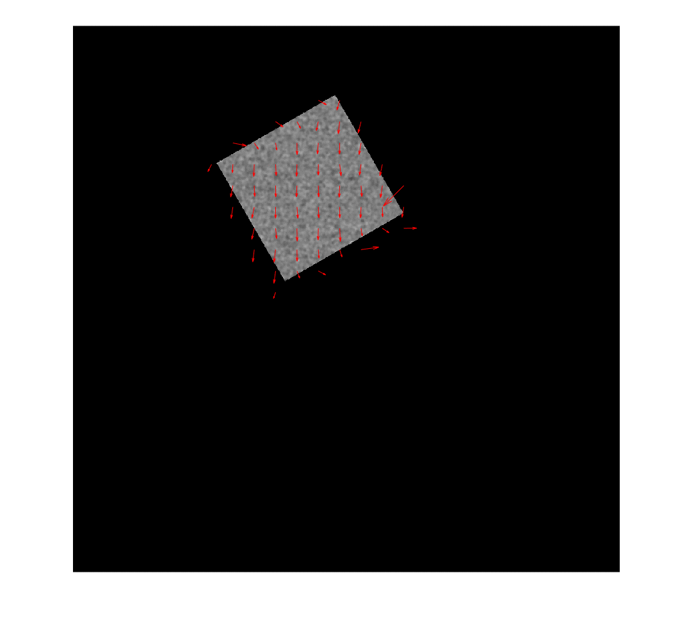

# DenseOpticalFlow
Optical flow is the pattern of apparent motion of image objects between consecutive frames caused by the movemement of object. It is represented by vector field. 
 
 
Result of first image sequence:

 
Result of second image sequence:

